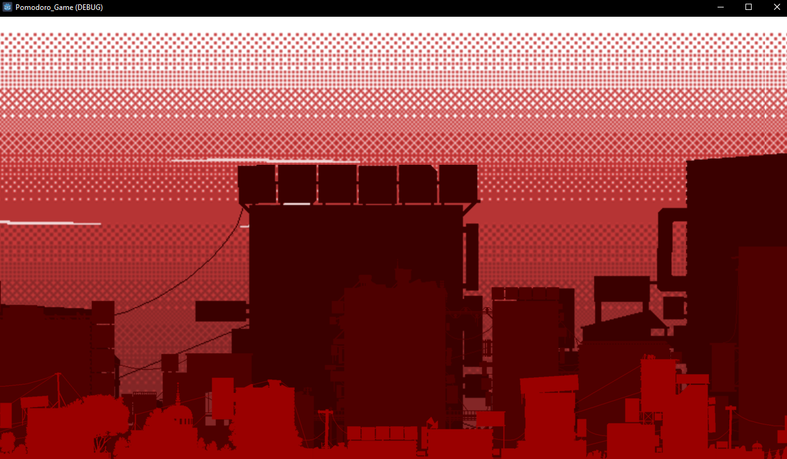
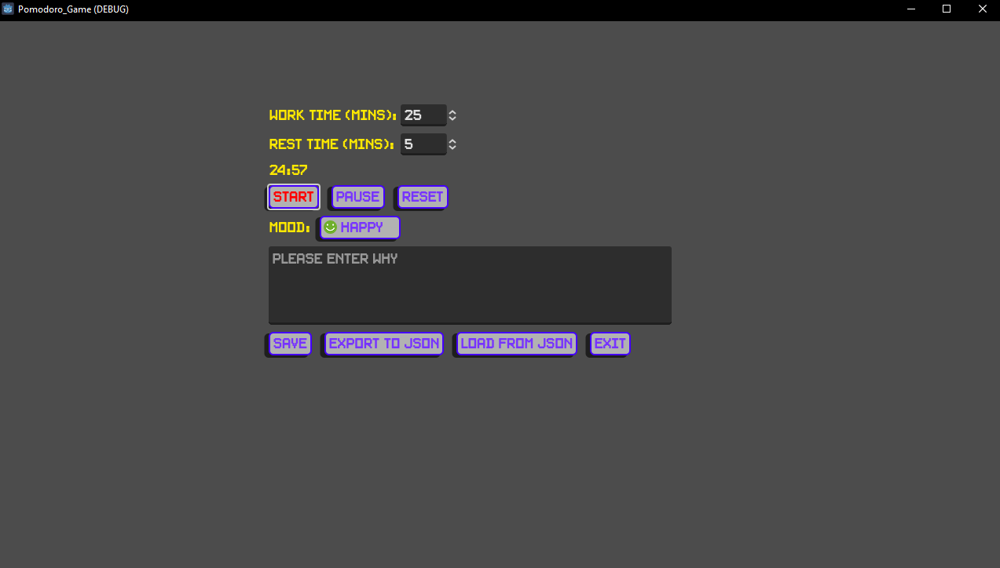
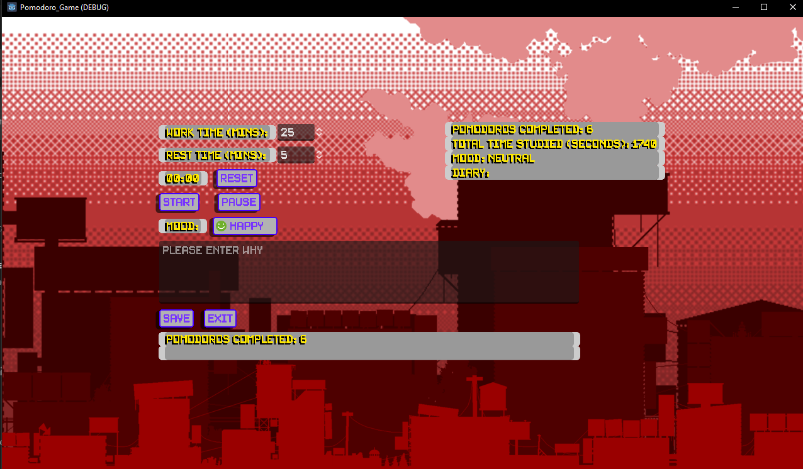

# Pomodoro Game

[Link To Game Will Be Placed Here](rstredytd)

## Project Goals: 

This is a working title for a Pomodoro game I had floating in my head for a bit. I wanted to make a Pomodoro app that was simple and tracked progress, gave good reports, while also pushing players to keep doing work and feel cozy. I feel alot of pomodoro games out there push too hard into the game category. 

Right now work is being done on just the base functionality, the pomodoro part of the game (timer/saving progress), then analytics, and then finally a game aspect that uses effects and progression to motivate players to continue making progress. 

I worked on parrallax backgrounds first to keep myself motivated to make this a polished product, you can see a preview below, well it won't move since it's a still image. But it gives you an idea of what it will look like.



UI is underway and it's not pretty, but it's not ugly either!


I also implemented an audio manager singleton so I can have a central place for sound effects instead of having to clutter up my workspace with nodes. I can extend it for music too.



## Tech Stack:
```bash
Just Godot 4.3 Stable...
```
## Design Document:

USER STORIES:

As a User I Want to X so I can Y
[x](Start, reset, pause, my pomodoro time so I can be flexible with my time)
[x](Set custom times for work and rest time, and resume the next pomodoro when I'm ready so I don't have to worry about the next work cycle starting without me)
[x](Write diary entries and select the mood I am in so I can express how I feel during each pomodoro)
[]()
[]()
[]()
[]()
[]()


